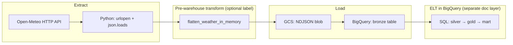

# Extraction and loading in this pipeline

This note maps **your code** (`weather_memory_extractor.py` + `weather_memory_dag.py`) to common data-engineering terms so the pattern stays clear beyond “I read it once.”

---

## Big picture

---

## What type of **extraction** you use

| Term | What it means | How **your** code does it |
|------|----------------|---------------------------|
| **Source** | Where data comes from | **Third-party REST API** — Open-Meteo (`https://api.open-meteo.com/v1/forecast`). |
| **Pull vs push** | Who initiates the transfer | **Pull extraction** — your DAG/task **calls** the API when it runs (on-demand / scheduled), not the vendor pushing files to you. |
| **Protocol** | How bytes move | **HTTPS GET** with query parameters (`latitude`, `longitude`, `start_date`, `end_date`, `hourly`, …). |
| **Client** | Library | **`urllib.request.urlopen`** (stdlib) — synchronous, single request/response. |
| **Format** | Payload shape | **JSON** in the HTTP body → **`json.loads`** → **in-memory Python `dict`**. |
| **Granularity** | Unit of one extract | **One API response per city + date window** (Netherlands and Yerevan are two parallel extract paths in the DAG). |

**Short label you can remember:** *pull-based **API JSON extraction** into process memory.*

**Code anchor:** `fetch_weather_in_memory()` in `weather_memory_extractor.py`.

---

## What type of **loading** you use

You have **two load steps** before BigQuery SQL (silver/gold/mart). Both are **batch** loads (a finite file or string per run), not streaming.

### 1) Load into **Google Cloud Storage (GCS)**

| Term | Meaning | Your implementation |
|------|---------|---------------------|
| **Pattern** | Staging / landing zone | **Write object to bucket** — acts as **durable staging** before the warehouse. |
| **Format** | File layout | **NDJSON** (one JSON object per line), built in Python and uploaded as a string. |
| **API style** | How you upload | **Server-side object create** via client library: `blob.upload_from_string(...)`. |

**Short label:** *batch **file/object load** to GCS (NDJSON staging).*

**Code anchor:** `upload_flattened_to_gcs()` in `weather_memory_extractor.py`.

### 2) Load into **BigQuery (bronze)**

| Term | Meaning | Your implementation |
|------|---------|---------------------|
| **Pattern** | Warehouse ingest | **Load job from GCS** — BigQuery reads **`gs://...`** and appends rows. |
| **Operation** | SQL vs load job | **`load_table_from_uri`** (Load Job API), not `INSERT` row-by-row from Python. |
| **Format** | How BQ parses the file | **`NEWLINE_DELIMITED_JSON`** (`SourceFormat.NEWLINE_DELIMITED_JSON`). |
| **Write mode** | What happens on repeat runs | **`WRITE_APPEND`** — new runs add rows (dedupe/cleaning is deferred to **silver** SQL). |

**Short label:** *batch **BigQuery load job** from GCS (append NDJSON into bronze).*

**Code anchor:** `upload_to_bigquery()` in `weather_memory_extractor.py`, called from `load_city_to_bigquery()` in `weather_memory_dag.py` with `dataset_id="bronze"` and `table_id="weather_raw_flattened_partitioned"`.

---

## How this fits **ELT** wording

- **Extract + load (into bronze):** implemented in **Python + GCS + BigQuery load jobs** as above.
- **Transform (silver → gold → mart):** implemented as **BigQuery SQL** in `dags/sql/*.sql`, orchestrated by `BigQueryInsertJobOperator` in `weather_memory_dag.py` — that is the classic **“T after L in the warehouse”** part of ELT.

**Flattening before GCS** is a small **in-pipeline transform** so bronze is **tabular-friendly**; it does not replace the later **warehouse ELT** layers.

---

## Quick glossary (one line each)

- **Batch load:** load a bounded dataset per task run (your case), vs continuous streaming.
- **Staging:** GCS holds an intermediate artifact the warehouse job reads.
- **Load job:** BigQuery’s managed bulk ingest from URIs (efficient for JSON/CSV/Avro at scale).

---

*Generated to match the `optimized-weather-INmemory` DAG and extractor as of the repo layout under `dags/`.*
